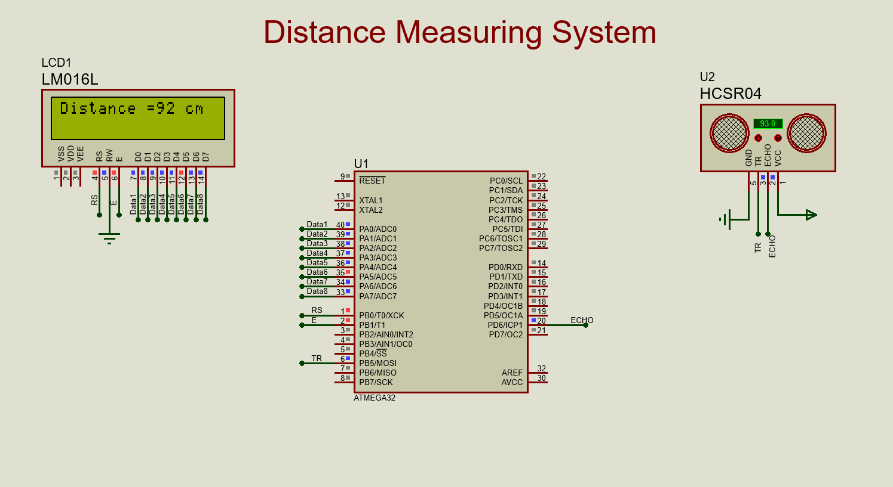

# Distance_Measuring_System
Developing a system that measure the distance by using an UltraSonic Sensor and display the measured distance on LCD.
- **Drivers**        : GPIO, ICU, Ultrasonic Sensor and LCD - Microcontroller: ATmega32.
- **Microcontroller**: ATmega32

